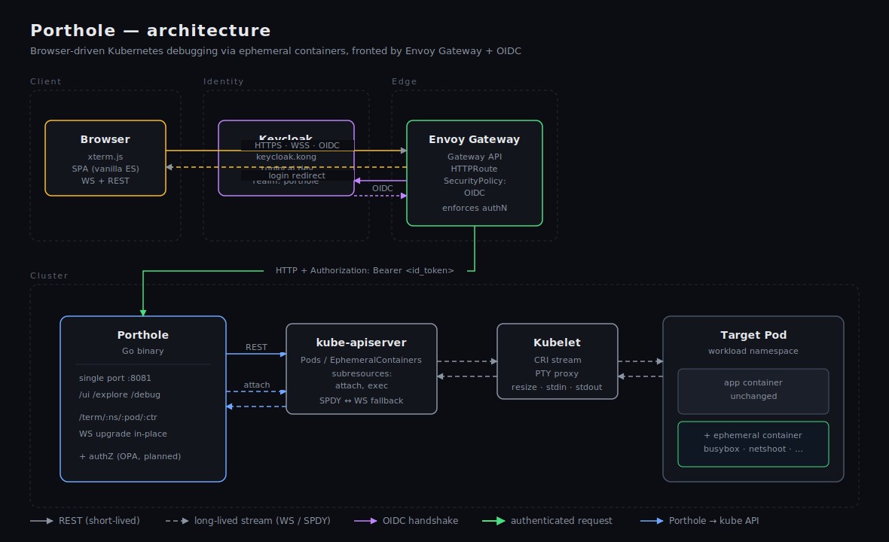

# Porthole

Web-based debug terminal for Kubernetes. Pick a pod, inject an ephemeral
container with the image you want (`busybox`, `netshoot`, `psql`, …),
attach to it from your browser. Pluggable authN (JWT/OIDC) and authZ
(OPA) so developers reach pods without `kubectl`, and without the cluster
having to know their corporate identity.



## Getting started

### Option A — no auth, smallest possible install

The fastest way to see it work: install the chart with auth disabled on
a fresh `kind` cluster, then port-forward.

```sh
kind create cluster --name porthole-demo

helm install porthole ./helm-chart/porthole \
  --namespace porthole --create-namespace \
  --values docs/examples/porthole/values.yaml

kubectl -n porthole rollout status deploy/porthole --timeout=120s
kubectl -n porthole port-forward svc/porthole 8081:8081 &
open http://localhost:8081/ui/
```

The chart is also published to GHCR as an OCI artifact, so you don't
need to clone the repo:

```sh
helm install porthole oci://ghcr.io/bcollard/charts/porthole \
  --version 0.1.0 \
  --namespace porthole --create-namespace \
  --set auth.disabled=true
```

With `auth.disabled=true` in the example values, every request is
stamped as the `local-dev` principal and OPA's default policy grants it
admin. Drive the UI immediately: pick a namespace, pick a pod, click
**+ Debugger**, you'll be attached as soon as the EC is running. Click
**Clean up all** to terminate every porthole-injected EC in that pod.

### Option B — fronted by an OIDC-aware gateway

For anything beyond a kubectl-port-forward demo you need an OIDC layer
in front: the browser has no way to attach a JWT itself, so something
along the request path must terminate the OIDC handshake and inject
`Authorization: Bearer <id_token>` for porthole to validate.

The porthole chart is **gateway-implementation neutral** — it renders
generic exposure resources (`Ingress`, Gateway API `HTTPRoute`,
LoadBalancer `Service`) and lets you wire the OIDC layer yourself. One
worked recipe in [`docs/examples/envoy-gateway/`](./docs/examples/envoy-gateway/):
a `values.yaml` you point `helm install` at, plus the Envoy-Gateway
`SecurityPolicy` CR applied separately.

**Sub-path hosting** — the chart accepts `gatewayAPI.pathPrefix` so
porthole can share a hostname with other backends behind a platform
gateway (e.g. `api.example.com/porthole`). The chart emits a 308
redirect for the trailing-slash case and a URLRewrite filter that
strips the prefix before forwarding upstream; the SPA infers the
public prefix from `window.location.pathname` at boot. No server-side
config and no rebuild — one image serves at root *or* under any
sub-path.

### Other OSS gateways with OIDC

Envoy Gateway isn't the only option. Other community stacks that
handle OIDC and pair well with the chart's generic exposure resources:

- **[oauth2-proxy](https://oauth2-proxy.github.io/oauth2-proxy/)** in
  front of any `auth_request`-capable ingress (ingress-nginx is the
  most common). De-facto OSS pattern.
- **[Pomerium](https://www.pomerium.com/)** — identity-aware proxy
  with native OIDC, OPA-compatible policy. Standalone (not a generic
  ingress).
- **[Caddy](https://caddyserver.com/)** + the third-party
  [`caddy-security`](https://github.com/greenpau/caddy-security)
  module.
- **[Authelia](https://www.authelia.com/)** or
  **[Authentik](https://goauthentik.io/)** as the OIDC layer in front
  of any `auth_request`-capable ingress.

The chart's `ingress.annotations` field is the join point with most of
these stacks.

### Run from source

```sh
AUTH_DISABLED=true go run .          # talks to your current kubectl context
open http://localhost:8081/ui/
```

Stamps a `local-dev` principal, skips OPA, useful for hacking on the
backend. The SPA at `pkg/web/dist/` is embedded into the binary, so a
plain `go build` is enough — no separate frontend build.

## Why

- **Simplicity.** Developers connect to a backend app in the cluster
  instead of proxying `kubectl exec` from their laptop. Lens/k9s also
  work but make the OIDC integration awkward when teams use different
  IdPs from the cluster.
- **Flexibility.** Inject *any* image you can pull from a registry as
  the debug container — `psql`, `redis-cli`, `dig`, your own forensic
  tools. No special configuration on the target pod.
- **Zero-trust.** The cluster's mesh policies still apply to the
  ephemeral container: it only reaches what the target pod can reach.
- **Corporate-identity friendly.** Authentication is enforced at the API
  gateway (Envoy Gateway + OIDC). The cluster doesn't need to know your
  corporate users; Porthole reads identity claims out of the JWT and
  consults an OPA sidecar for authorization.

## Architecture

Three diagrams, each at a different zoom level:

- [`docs/architecture.svg`](./docs/architecture.svg) — system layout:
  browser → Envoy Gateway (+ OIDC) → Porthole → kube-apiserver → kubelet
  → ephemeral container.
- [`docs/traffic-flow.svg`](./docs/traffic-flow.svg) — byte paths
  through an attach session: stdout, stdin, and resize travel three
  distinct chains across the websocket, the k8s executor, the kubelet,
  and the PTY.
- [`docs/sequence.svg`](./docs/sequence.svg) — page load → discovery →
  inject → attach → live session → close.

## Authentication (JWT)

Porthole validates a JWT on every request. The token can come from:

- The configured **id_token header** (default `X-ID-Token` — set by an
  upstream API gateway after OIDC login). Operators who terminate
  OIDC elsewhere can point this at any header the gateway writes,
  e.g. `Authorization` or `X-Forwarded-Access-Token`.
- `Authorization: Bearer <token>` (canonical OAuth fallback — always
  accepted, works with Envoy Gateway's `forwardAccessToken` setting
  with no extra config).

| Env var                  | Example |
|--------------------------|---------|
| `JWKS_URL`               | `http://keycloak/realms/porthole/protocol/openid-connect/certs` |
| `OIDC_ISSUER`            | `http://keycloak/realms/porthole` |
| `OIDC_AUDIENCE`          | _(optional)_ expected `aud` claim |
| `ID_TOKEN_HEADER`        | _(optional, default `X-ID-Token`)_ header the gateway writes the id_token to |
| `ID_TOKEN_HEADER_PREFIX` | _(optional)_ prefix to trim from that header — e.g. `Bearer ` when `ID_TOKEN_HEADER=Authorization` |
| `AUTH_DISABLED`          | `true` to bypass JWT validation (local dev only) |

Chart values: `auth.idTokenHeader` and `auth.idTokenHeaderPrefix`.

If the configured header is present but its value doesn't carry the
configured prefix, the value is ignored and the `Authorization: Bearer`
fallback is tried — so a misconfigured prefix can't silently feed garbage
to the JWT parser.

The middleware uses the `keyfunc/v3` library, which pins each token to
the algorithm declared in the JWKS — `alg:none` and HMAC-with-RSA-key
confusion attacks are rejected at the library level.

## Authorization (OPA)

Every handler asks OPA for a yes/no decision before touching the kube
API. OPA runs as a sidecar in the porthole pod; policy + data come from
a ConfigMap (you can override it via chart values or by mounting your
own bundle).

```json
{
  "input": {
    "user":             { "sub": "...", "email": "...", "groups": ["..."] },
    "request":          { "action": "inject_ec", "namespace": "team-a-prod", "pod": "target" },
    "now":              "2026-06-07T14:00:00Z",
    "namespace_labels": { "team": "a", "tier": "production" }
  }
}
```

The action vocabulary is fixed (in `pkg/auth/opa.go` + the Rego):

- `list_namespaces`, `list_pods`, `list_ec`
- `inject_ec`, `attach_ec`, `terminate_ec`

`policy/data.json` defines two tables: **roles** (action bundles) and
**bindings** (group → role → namespace scope).

```json
{
  "policy": {
    "roles": {
      "viewer":   ["list_namespaces", "list_pods", "list_ec"],
      "debugger": ["list_namespaces", "list_pods", "list_ec",
                   "inject_ec", "attach_ec", "terminate_ec"],
      "admin":    ["list_namespaces", "list_pods", "list_ec",
                   "inject_ec", "attach_ec", "terminate_ec"]
    },
    "bindings": [
      { "group": "porthole-admins", "role": "admin",    "namespace_glob": "*" },
      { "group": "team-a",          "role": "debugger", "namespace_glob": "team-a-*" },
      { "group": "secops",          "role": "debugger",
        "namespace_labels": { "tier": "production" } }
    ]
  }
}
```

A binding can scope by **glob**, by **namespace labels**, or by **both
together** (logical AND). Cluster-wide actions (`list_namespaces`)
require an unconditional `namespace_glob: "*"` — a label-scoped binding
cannot grant them.

`business_hours: true` on a binding restricts it to Mon-Fri 09:00–17:00
UTC. Namespace labels are fetched lazily from the kube API and cached
for 60s (`pkg/authdata`, fail-open).

### Editing the policy

```sh
$EDITOR policy/porthole.rego policy/data.json
make opa-eval         # 15-case local sanity check, no cluster required
```

In a helm-installed cluster, push the edited policy through chart
values:

```sh
helm upgrade porthole ./helm-chart/porthole \
  --reuse-values \
  --set-file opa.policy=./policy/porthole.rego \
  --set-file opa.data=./policy/data.json
```

OPA hot-reloads the mounted files; no pod restart needed.

## Ephemeral container cleanup

Kubernetes ephemeral containers are immutable — once added to a pod
spec they stay forever. "Cleanup" therefore means terminating the
running process so kubelet flips the EC status to `Terminated` and
reclaims resources.

Two surfaces:

- **UI** — the **Clean up all** button on the EC bar terminates every
  `porthole-*` running EC on the selected pod.
- **Server-side sweeper** — set `EC_SWEEP_TTL=30m` (chart value
  `ecSweepTTL`) and a background goroutine periodically terminates
  porthole-injected ECs older than the TTL. Off by default.

Porthole only ever touches ECs whose name starts with `porthole-`
(the prefix `Inject` stamps). ECs created out-of-band are left alone.

## Audit log

One structured `slog` JSON line per security-relevant decision, written
to stdout. Keys are stable across releases so a SIEM rule keyed on
`action` catches every inject, attach-deny, and cleanup.

```json
{
  "time":             "2026-06-07T10:53:45Z",
  "level":            "INFO|WARN",
  "msg":              "inject|attach|cleanup",
  "action":           "inject|attach_ec|terminate_ec",
  "user":             "<sub claim>",
  "source_ip":        "10.0.1.5",
  "namespace":        "demo",
  "pod":              "target",
  "image":            "busybox:1.36",
  "duration_ms":      53,
  "outcome":          "success|error|denied",
  "debug_container":  "porthole-a2045e61",
  "reason":           "default deny"
}
```

Successful attaches are intentionally not audited per-byte; the *start*
of an attach session shows in gin's access log, and an authZ-deny on
attach lands here as `outcome:"denied"` with the OPA reason.

## Configuration reference

| Env var               | Default                  | What it does |
|-----------------------|--------------------------|---|
| `PORT`                | `8081`                   | Single HTTP port — SPA, REST, WS, all here. |
| `AUTH_DISABLED`       | _(unset)_                | `true` → skip JWT validation, stamp a `local-dev` principal. |
| `JWKS_URL`            | _(required)_             | IdP JWKS endpoint, used to validate inbound JWTs. |
| `OIDC_ISSUER`         | _(optional)_             | Expected `iss` claim. Empty disables the check. |
| `OIDC_AUDIENCE`       | _(optional)_             | Expected `aud` claim. Empty disables the check. |
| `ID_TOKEN_HEADER`     | `X-ID-Token`             | Request header read first for the id_token. Set to `Authorization` (with `ID_TOKEN_HEADER_PREFIX=Bearer `) when the gateway forwards under the canonical OAuth header. |
| `ID_TOKEN_HEADER_PREFIX` | _(unset)_             | Prefix to trim from `ID_TOKEN_HEADER`'s value. If the header is present but doesn't carry this prefix, the canonical `Authorization: Bearer` fallback is tried. |
| `OPA_URL`             | _(unset → OPA disabled)_ | OPA decision endpoint, e.g. `http://localhost:8181/v1/data/porthole/authz/decision`. |
| `WS_ALLOWED_ORIGINS`  | _(unset → same-origin)_ | Comma-separated allowlist of `Origin` headers accepted for WS upgrades. Defends against CSWSH. |
| `EC_SWEEP_TTL`        | _(unset → disabled)_     | Auto-terminate porthole-injected ECs older than this duration (e.g. `30m`). |

## Repo layout

```
.
├── main.go                 # single-port gin engine
├── pkg/
│   ├── controllers/        # HTTP/WS handlers (discovery, inject, attach, cleanup)
│   ├── ephemeral/          # k8s patch + attach via remotecommand, + sweeper
│   ├── util/               # WsSession (binary stdin + JSON-text control)
│   ├── auth/               # JWT middleware + OPA client
│   ├── authdata/           # cached ns-label lookups for OPA input
│   ├── audit/              # one slog JSON line per inject/attach/cleanup
│   ├── kubeconfig/         # in-cluster + ~/.kube fallback
│   └── web/dist/           # embedded SPA (xterm.js, vanilla ES modules)
├── policy/
│   ├── porthole.rego       # authZ rules — groups × namespace × labels × time
│   └── data.json           # roles + bindings
├── helm-chart/porthole/    # canonical install path (chart)
├── docs/
│   ├── examples/           # ready-to-run example deployments
│   │   ├── porthole/       # smallest install, no gateway, no auth
│   │   └── envoy-gateway/  # Envoy Gateway + OIDC SecurityPolicy
│   └── *.svg               # architecture diagrams
├── scripts/
│   ├── keycloak-bootstrap.sh  # idempotent realm/client/user setup via curl
│   ├── envoy-smoke.sh         # ROPC + curl through the gateway
│   └── opa-eval.sh            # 15 policy cases run locally
└── Makefile
```

## Development

```sh
go build ./...            # binary, sanity check
go run .                  # uses your current kubectl context
make opa-eval             # 15-case Rego sanity check
helm lint helm-chart/porthole
helm template porthole helm-chart/porthole -f docs/examples/porthole/values.yaml
```

The SPA lives at `pkg/web/dist/`. Edit, then re-`go build` to re-embed.

## Resources

- [How `kubectl exec` works](https://erkanerol.github.io/post/how-kubectl-exec-works/)
- [Ephemeral containers with client-go](https://github.com/iximiuz/client-go-examples/blob/main/patch-add-ephemeral-container/main.go)
- [Envoy Gateway SecurityPolicy / OIDC](https://gateway.envoyproxy.io/docs/tasks/security/oidc/)
- [OPA Rego language](https://www.openpolicyagent.org/docs/latest/policy-language/)
