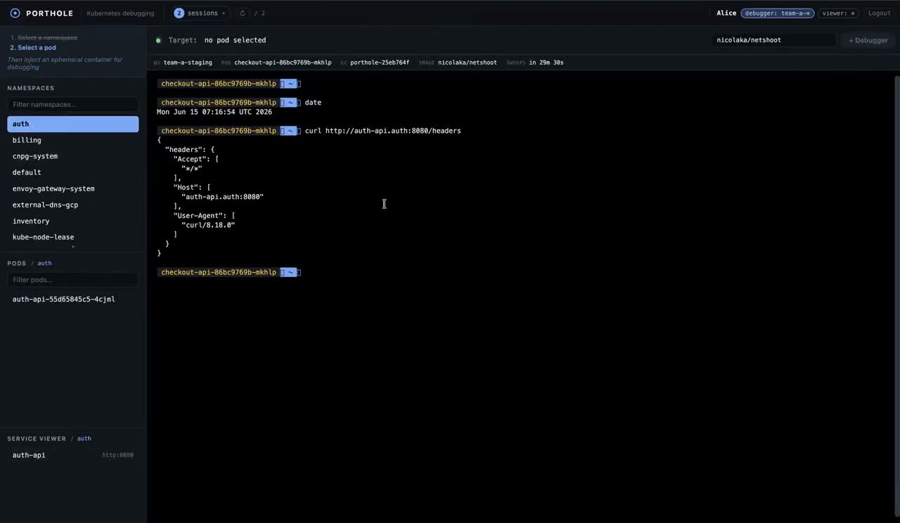

# Porthole

Web-based debug terminal for Kubernetes. Pick a pod, inject an ephemeral
container with the image you want (`busybox`, `netshoot`, `psql`, …),
attach to it from your browser. Pluggable authN (JWT/OIDC) and authZ
(OPA) so developers reach pods without `kubectl`, and without the cluster
having to know their corporate identity.

[](https://porthole.runlocal.dev/)

> Click the still for the live demo on [porthole.runlocal.dev](https://porthole.runlocal.dev/).

## Getting started

Smallest possible install — no auth, no policy. Port-forward and drive
the UI immediately.

```sh
helm install porthole oci://ghcr.io/bcollard/charts/porthole \
  --version 0.2.0 \
  --namespace porthole --create-namespace \
  --set auth.disabled=true

kubectl -n porthole port-forward svc/porthole 8081:8081 &
open http://localhost:8081/ui/
```

`auth.disabled=true` stamps every request as a `local-dev` principal
and grants admin everywhere. Anything beyond a `kubectl
port-forward` demo needs the OIDC layer below.

## Authentication — front porthole with an OIDC gateway

The browser can't speak OIDC to porthole on its own; something on
the request path has to terminate the handshake and inject the
user's id-token into the request headers. Porthole then validates
the JWT against the IdP's JWKS and reads the user claims off it.

Reference stack: **Envoy Gateway** + its `SecurityPolicy` CR. The
chart renders a generic `HTTPRoute`; you attach a `SecurityPolicy`
to it that does the OIDC handshake. Worked recipe in
[`docs/examples/envoy-gateway/`](./docs/examples/envoy-gateway/) —
a `values.yaml` for `helm install` plus the `SecurityPolicy` you
apply separately.

The chart handles the awkward bits:

- **Configurable id-token header** — `auth.idTokenHeader` defaults
  to `X-ID-Token` (Envoy Gateway's `forwardIDToken`). Point it at
  `Authorization` (with `auth.idTokenHeaderPrefix: "Bearer "`) when
  you'd rather rely on `forwardAccessToken`. The canonical
  `Authorization: Bearer` fallback is *always* tried, so
  `forwardAccessToken: true` works with zero extra config.
- **Sub-path hosting** — `gatewayAPI.pathPrefix=/porthole` lets
  porthole share a hostname with other apps behind one platform
  gateway (`api.example.com/porthole`). The chart emits a 308 for
  the missing trailing slash and a `URLRewrite` that strips the
  prefix; the SPA infers the public prefix from
  `window.location.pathname` at boot. Same image works at root or
  under any prefix.

For the OIDC handshake itself, see the Envoy Gateway docs:
[Envoy Gateway SecurityPolicy / OIDC](https://gateway.envoyproxy.io/docs/tasks/security/oidc/).

## Authorization — OPA: what's cooked in vs. what you write

Every handler asks the OPA sidecar for a yes/no decision before
touching the kube API. The chart bundles OPA as a sidecar; policy +
data live in a ConfigMap you can override at install time.

### What porthole ships (don't touch unless you mean to)

- **OPA input** — `pkg/auth/opa.go` builds the input on every
  request: user claims (sub/email/groups), the requested action,
  namespace, namespace labels (fetched lazily, cached 60 s), and
  the current timestamp.
- **Rego logic** — `policy/porthole.rego` carries the matchers:
  glob + labels + business-hours, AND-composed, default-deny. Plus
  an `effective_bindings` rule the SPA queries on `/api/me` so the
  topbar can render the user's role chips.
- **Action vocabulary** — fixed set the handlers ask OPA for:

  | Action            | Triggered by                                |
  |-------------------|---------------------------------------------|
  | `list_namespaces` | the namespace picker (cluster-wide)         |
  | `list_pods`       | the pod picker, Service Viewer              |
  | `list_ec`         | the EC chip bar refresh                     |
  | `inject_ec`       | clicking **+ Debugger**                     |
  | `attach_ec`       | opening a WebSocket terminal, extending TTL |
  | `terminate_ec`    | clicking ×, "Clean up all", or the sweeper  |

### What you write — `policy/data.json`

Two tables: **roles** (bundle actions) and **bindings** (group →
role → namespace scope). Override via chart values; OPA hot-reloads
without a pod restart.

```sh
helm upgrade porthole oci://ghcr.io/bcollard/charts/porthole \
  --reuse-values \
  --set-file opa.data=./my-bindings.json
```

```json
{
  "policy": {
    "roles": {
      "viewer":   ["list_namespaces", "list_pods", "list_ec"],
      "debugger": ["list_namespaces", "list_pods", "list_ec",
                   "inject_ec", "attach_ec", "terminate_ec"]
    },
    "bindings": [
      { "group": "porthole-admins", "role": "debugger", "namespace_glob": "*" },
      { "group": "team-a",          "role": "debugger", "namespace_glob": "team-a-*" },
      { "group": "secops",          "role": "debugger", "namespace_labels": { "tier": "production" } },
      { "group": "oncall",          "role": "debugger", "namespace_glob": "*", "business_hours": true }
    ]
  }
}
```

A binding always carries `group` + `role` + one or more matchers:

| Matcher            | Behavior                                                                                                                                                                |
|--------------------|-------------------------------------------------------------------------------------------------------------------------------------------------------------------------|
| `namespace_glob`   | Shell-style glob over the namespace name. `*` is cluster-wide. Required to grant cluster-wide actions (`list_namespaces`) — a label-only binding cannot grant them.     |
| `namespace_labels` | All `key: value` pairs must equal labels on the namespace.                                                                                                              |
| `business_hours`   | When `true`, only matches Mon-Fri 09:00–17:00 UTC.                                                                                                                      |

Matchers on the same binding compose with **AND**. Multiple bindings
compose with **OR**. Default is deny. Sanity-check locally:

```sh
make opa-eval         # 15 case Rego suite, no cluster required
```

## Helm values reference

| Value | Default | What it does |
|---|---|---|
| `image.repository` | `ghcr.io/bcollard/porthole` | Porthole image. |
| `image.tag` | _(unset)_ | Defaults to `Chart.AppVersion`. |
| `replicas` | `1` | Replica count. |
| `auth.disabled` | `false` | Stamp `local-dev` on every request, skip JWT validation. **Local dev only.** |
| `auth.jwksURL` | `""` | IdP JWKS endpoint. Required when `auth.disabled` is `false`. |
| `auth.issuer` | `""` | Expected `iss` claim. Empty disables the check. |
| `auth.audience` | `""` | Expected `aud` claim. Empty disables the check. |
| `auth.idTokenHeader` | `""` | Request header read first for the id-token. Empty → `X-ID-Token`. |
| `auth.idTokenHeaderPrefix` | `""` | Prefix to trim from `auth.idTokenHeader`. Set to `"Bearer "` when pointing at `Authorization`. |
| `opa.enabled` | `true` | Run the OPA sidecar. |
| `opa.url` | `http://localhost:8181/v1/data/porthole/authz/decision` | Decision endpoint. |
| `opa.policy` | _(inline default)_ | Rego policy — override with `--set-file opa.policy=…`. |
| `opa.data` | _(inline default)_ | Roles + bindings JSON — override with `--set-file opa.data=…`. |
| `wsAllowedOrigins` | `""` | Comma-separated `Origin` allowlist for the `/term` WebSocket. CSWSH defence — required behind a gateway. |
| `ecSweepTTL` | `""` | Auto-terminate porthole-injected ECs older than this duration (e.g. `30m`). Off by default. |
| `logoutPath` | `/logout` | Gateway's logout path; the SPA prepends `gatewayAPI.pathPrefix`. |
| `gatewayAPI.enabled` | `false` | Render an `HTTPRoute` (and optional `Gateway`) for Gateway API. |
| `gatewayAPI.hostnames` | `[porthole.example.com]` | `HTTPRoute.hostnames`. |
| `gatewayAPI.pathPrefix` | `/` | Public sub-path; e.g. `/porthole`. |
| `gatewayAPI.gateway.create` | `false` | Also render a dedicated `Gateway` alongside the `HTTPRoute`. |
| `ingress.enabled` | `false` | Render a standard `Ingress` instead of Gateway API resources. |

Full schema with comments: [`helm-chart/porthole/values.yaml`](./helm-chart/porthole/values.yaml).

## Audit log

One structured `slog` JSON line on stdout per security-relevant
action — every inject, attach-deny, and cleanup. Shaped to the
[Elastic Common Schema](https://www.elastic.co/guide/en/ecs/8.11/index.html)
(v8.11) so it ingests into Elastic, Loki, Splunk, anything that
keys on `event.action` / `event.outcome` / `user.id` /
`kubernetes.namespace` with no custom parser.

A denied inject looks like this — `event.type: denied`,
`event.outcome: failure`, and the OPA decision text in
`event.reason`:

```json
{
  "@timestamp":    "2026-06-07T10:53:45Z",
  "log.level":     "WARN",
  "message":       "inject",
  "ecs.version":   "8.11",
  "event": {
    "kind":        "event",
    "category":    ["iam"],
    "action":      "inject_ec",
    "type":        "denied",
    "outcome":     "failure",
    "dataset":     "porthole.audit",
    "provider":    "porthole",
    "duration":    12387251,
    "reason":      "matched: group=junior-devs role=debugger ns=dev-checkout — outside business hours"
  },
  "user":          { "id": "alice@example.com" },
  "source":        { "ip": "10.0.1.5" },
  "kubernetes":    { "namespace": "dev-checkout",
                     "pod": { "name": "api-7d4b9c5f-mznpr" } },
  "container":     { "image": { "name": "nicolaka/netshoot" } }
}
```

Successful path: `event.type: creation` (inject) / `deletion`
(cleanup), `event.outcome: success`. Internal errors collapse into
`event.outcome: failure`, `event.type: error`, with the error text
on `error.message`. Per-byte attach traffic is intentionally not
audited — the start of a session shows in gin's access log, and an
authZ-deny on attach lands here as `attach_ec` / `denied`.

Implementation: [`pkg/audit/audit.go`](./pkg/audit/audit.go). The
canonical shape per event type lives in
[`pkg/audit/audit_smoke_test.go`](./pkg/audit/audit_smoke_test.go) —
`go test -v ./pkg/audit/` pretty-prints one of each.

## Architecture diagrams

Three SVGs, each at a different zoom level:

- [`docs/architecture.svg`](./docs/architecture.svg) — system
  layout: browser → Envoy Gateway (+ OIDC) → Porthole →
  kube-apiserver → kubelet → ephemeral container.
- [`docs/traffic-flow.svg`](./docs/traffic-flow.svg) — byte paths
  through an attach session: stdout / stdin / resize travel three
  distinct chains across the WebSocket, the k8s executor, kubelet,
  and the PTY.
- [`docs/sequence.svg`](./docs/sequence.svg) — page load →
  discovery → inject → attach → live session → close.

## Development

```sh
go build ./...                  # binary, sanity check
AUTH_DISABLED=true go run .     # uses your current kubectl context
open http://localhost:8081/ui/
make opa-eval                   # 15-case Rego sanity check
helm lint helm-chart/porthole
```

The SPA at `pkg/web/dist/` is embedded into the Go binary via
`go:embed`. Edit, then `go build` to re-embed — no separate frontend
build step.

### Resources

- [How `kubectl exec` works](https://erkanerol.github.io/post/how-kubectl-exec-works/)
- [Ephemeral containers with client-go](https://github.com/iximiuz/client-go-examples/blob/main/patch-add-ephemeral-container/main.go)
- [Envoy Gateway SecurityPolicy / OIDC](https://gateway.envoyproxy.io/docs/tasks/security/oidc/)
- [OPA Rego language](https://www.openpolicyagent.org/docs/latest/policy-language/)
